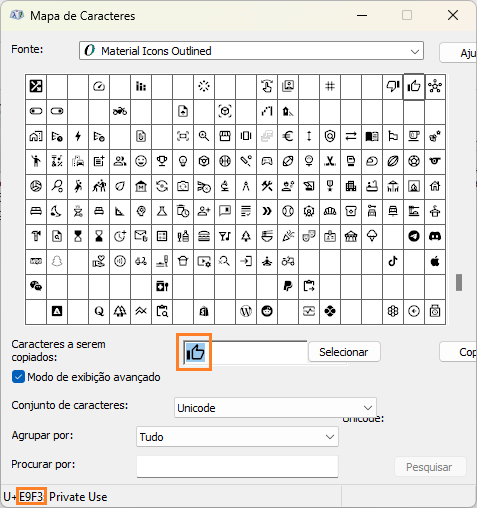
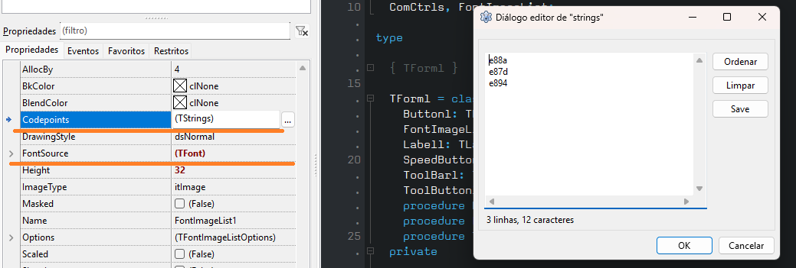
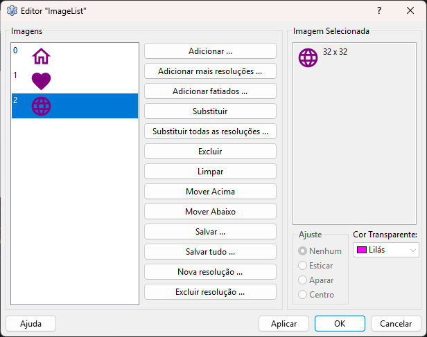

##  TFontImageList

The TFontImageList is a Lazarus component that store gryphs/images used by graphic controls. The component generates its own images using an installed font.
It work just like a TImageList but using `code point` of installed font on development computer. The images are built in design-time
and dont require the font installed on deployment. So you dont need redistribute the font with your software or access the internet to get it. 
Some fonts are made for this purpose and we take advantage of this for generate a monochrome gryphs/images like websites and mobile apps does.
 
> Just in the case you dont know what we are taking about you must read about at [Code point](https://wikipedia.org/wiki/Code_point/). 

## 🔗 Visit
Some recommended fonts with a lot of icons for use, find out the `code point` of the icon, never the `icon name`.
- [Google fonts](https://fonts.google.com/icons/)
- [Pictogrammers](https://pictogrammers.com/)

## #️⃣ Limitations
- The limitation is one font for each TFontImageList component, using the same color and size for all icons of it. 
- You need to know if the font size you choose fit inside the image list sizes width/height. The componente does not stretch or calc anything for you. Some adjusts are possible inside the images using XOffset and YOffset property options for all icons.

## 📦 Packages
There is two packages availables, use them according your needs. Do not install both, only one is allowed at time.
1. FontImageListBGRABitmap: This package uses the third party softwares for generate a transparent background with high quality for all platforms, and colored as well. Users usually require transparent background to use with native control background, so its very recommended. See the <https://bgrabitmap.github.io/>
2. FontImageListLCL: This package uses the canvas to generate the images. Its not very accurated for transparent background, but generates the perfect colored background. When you only need the images with colored background this is a perfect choice.
- The packages must install the component TFontImageList for the `Misc` pallete.
- The compile definition `FONTIMGLIST_FORCE_RUNTIME_BUILD_ICONS` must be defined if you want to generate images at run-time after change `Codepoints` property. This case you must have the font installed on running computer.

## ⚙️ Steps
1. Find out the desired codepoints for build the images. Usually the font owners provides a way or a list of them. They also can be found using a simple charmap program.

2. Put the TFontImageList on TForm/TFrame/TDataModule, change the `Width` and the `Height` with the required image geometry.
3. Go to `Options` property(TFontImageListOptions) if you want the colored background or keep the `clNone` for transparente background.
4. Go To `FontSource` property for choose the font/color/height of your images. The font must be already installed at this moment.
5. Go to `Codepoints` property and write the codepoints of images. For each line only one codepoint is written and must be like: `e88a` or `$e88a`.

6. Every time you change the `Codepoints` property at design-time then all images of list is generated. Dont forget revisit this property after change some other property.
7. Save your form for persistence of the generated images.

8. Its all, enjoy.
 
## ⌨️ Copyright notice
© 2025 Humberto Teófilo, All Rights Reserved.   

## ☀️ License
This software is released under Modified LGPL(with linking exception, same of LCL). This is a free software, inclusive for comercial use and modifications under the license terms. See the file `license.txt`.
